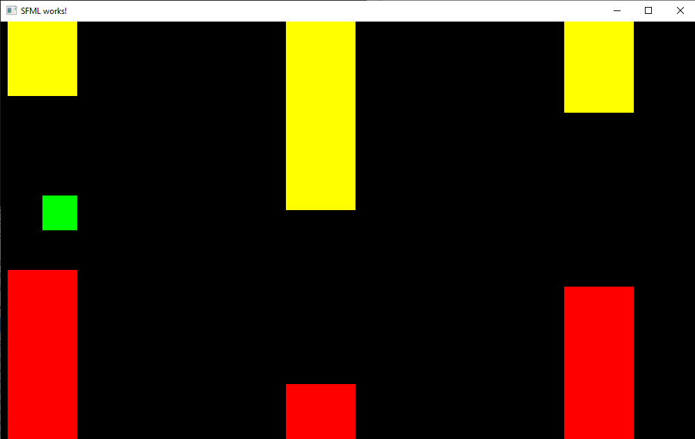

# Flappy Bird (06.2020)
Uproszczona graficznie wersja popularnej gry Flappy Bird. Gra ta polega na unikaniu pojawiających się z prawej strony kolumn. Użytkownik może poruszać się jedynie pionowo.

## Technologie:
* Główny język - C++,
* GUI - SFML (biblioteka graficzna języka C++).

## Widok gry:

    

